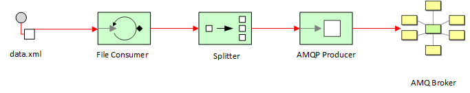

Large XML Processor in Fuse 7.7
====================================

This project demonstrates how to process a large (20MB+) XML file using Red Hat Fuse 7.7.  The Camel Route makes use of streaming, paralell processing and JMS connection pooling.



## Prerequisites

- VSCode 1.4+
- OpenShift 4.x+
- Fuse 7.7 Image Streams (template found [here](https://raw.githubusercontent.com/jboss-fuse/application-templates/master/fis-image-streams.json))
- AMQ 7.7 Broker standalone (download [here](https://access.redhat.com/jbossnetwork/restricted/softwareDownload.html?softwareId=84211)) or AMQ 7.7/0.15.0 Operator (download [here](https://access.redhat.com/jbossnetwork/restricted/softwareDownload.html?softwareId=84161))

## Deployment

This project can be deployed using two methods:

* Standalone Spring-Boot container
* On an Openshift 4.x+ environment using Fuse 7.7, either s2i binary or s2i source.

## Standalone Spring Boot Container

The standalone method takes advantage of the [Camel Spring Boot Plugin](http://camel.apache.org/spring-boot.html) to build and run the microservice.

1. Unzip and create a new AMQ 7.7 message broker
2. Startup the AMQ 7.7 broker and login to the message console (http://localhost:8161/console/login)
3. Create a new `Anycast` queue called `museum-items`.
4. Via the CLI, execute the following command from the root project directory:

```
mvn clean spring-boot:run
```

The SpringBoot appliation should run and consume the `data/asian-20181028.xml` file.  If successful, there should be 22000+ messages in the message-items queue.  You can verify this by browsing the queue via the AMQ Console.

## Openshift Deployment

1. First, create a new OpenShift project called *large-xml-processor*

```
oc new-project large-xml-processor --description="Fuse Large XML Processor Demo" --display-name="Large XML Processor"
```

2. Unzip the AMQ 7.7 operator in a local directory, then execute the following command:

```
oc create -f deploy/catalog_resources/activemq-artemis-operatorsource.yaml
```

3. Install the **Red Hat Integration - AMQ Broker** Operator found in Operator Hub.  Ensure it is version `0.15.0`.

4. Create a message broker using the following CRD:

```
apiVersion: broker.amq.io/v2alpha2
kind: ActiveMQArtemis
metadata:
  name: ex-aao
  application: ex-aao-app
spec:
  version: 7.7.0
  deploymentPlan:
    size: 2
    image: registry.redhat.io/amq7/amq-broker:7.7
    requireLogin: false
    persistenceEnabled: false
    journalType: nio
    messageMigration: false
  console:
    expose: true
  acceptors:
    - name: amqp
      protocols: amqp
      port: 5672
      sslEnabled: false
      enabledProtocols: TLSv1,TLSv1.1,TLSv1.2
      needClientAuth: true
      wantClientAuth: true
      verifyHost: true
      sslProvider: JDK
      sniHost: localhost
      expose: true
      anycastPrefix: jms.queue.
      multicastPrefix: /topic/
  connectors:
    - name: connector0
      host: localhost
      port: 22222
      sslEnabled: false
      enabledProtocols: TLSv1,TLSv1.1,TLSv1.2
      needClientAuth: true
      wantClientAuth: true
      verifyHost: true
      sslProvider: JDK
      sniHost: localhost
      expose: true
  upgrades:
      enabled: false
      minor: false
```

5. Via the CLI, execute the following command which will execute the *openshift* profile that executes the `clean fabric8:deploy` maven goal:

```
mvn -P openshift clean install fabric8:deploy
```

The fabric8 maven plugin will perform the following actions:

* Compiles and packages the Java artifact
* Creates the OpenShift API objects
* Starts a Source to Image (S2I) binary build using the previously packaged artifact
* Deploys the application using binary streams